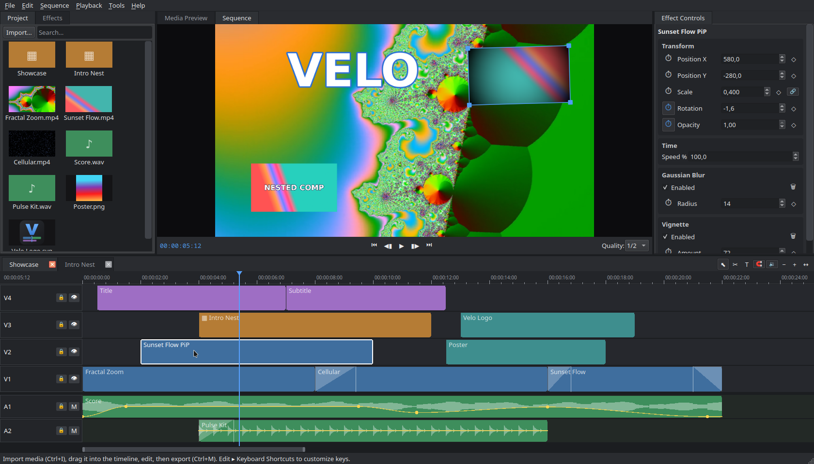

# Interface overview

Velo uses the panel layout most editors will recognize:

| Area | Panel | What it does |
|---|---|---|
| Top left | **Project** / **Effects** tabs | The [Project panel](project-panel.md) holds your imported media and sequences; the Effects tab lists every [effect and transition](../effects/applying.md) ready to drag onto clips. |
| Top center | **Media Preview** / **Sequence** monitors | The [Media Preview](media-preview.md) plays source clips and sets in/out points; the [Sequence monitor](sequence-monitor.md) shows the timeline render and lets you manipulate clips directly in the picture. |
| Top right | **Effect Controls** | The [Effect Controls panel](effect-controls.md) edits the selected clip's transform, volume, speed, text style and effect parameters — with keyframing. |
| Bottom | **Timeline** | The [timeline](timeline.md) is where editing happens: tracks, clips, trimming, transitions and the toolbar with tools and zoom. |

## Menus

- **File** — project new/open/save, recent projects, media import (files
  and folders), new sequence, export, quit.
- **Edit** — undo/redo, copy/paste, select all, split, delete and ripple
  delete, nesting, and the keyboard-shortcut editor.
- **Sequence** — add video/audio tracks, add text, timeline zoom, magnetic
  snapping.
- **Playback** — transport controls, frame stepping, in/out points, audio
  scrubbing and the audio output device picker.
- **Tools** — selection and razor tools.
- **Help** — about dialog.

Almost every menu item has a keyboard shortcut, and every shortcut is
rebindable — see [Keyboard shortcuts](../shortcuts.md).

## Status bar

The bottom edge of the window shows hints and confirmations — for example
where a project was saved. The window title shows the current project name
with a `*` when there are unsaved changes.
